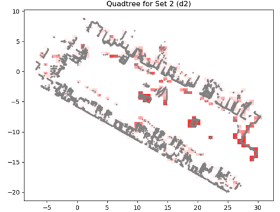

# Change Detection in 2D & 3D Point-Clouds

This repository implements methods for detecting structural changes in multi-temporal point-cloud data — both in 2D and 3D.
It contains:

A 2D change detection module using a quadtree-based approach.

A 3D change detection workflow for volumetric point clouds.

