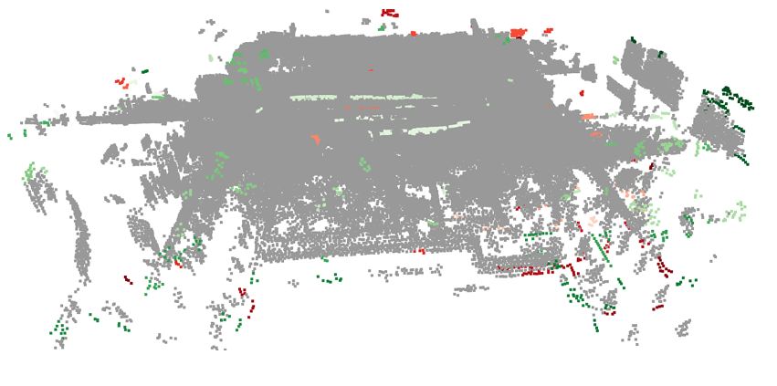

# Change Detection in 2D & 3D Point-Clouds

This repository implements methods for detecting structural changes in multi-temporal point-cloud data — both in 2D and 3D.
It contains:

A 2D change detection module using a quadtree-based approach.

A 3D change detection workflow for volumetric point clouds.

3D & 2D LiDAR Change Detection Framework

This repository implements a robust pipeline for detecting structural and object-level changes in multi-temporal LiDAR point cloud data. The framework is designed for dynamic environments such as warehouses and urban scenes, where inventory movement, occlusions, and sensor noise present significant challenges.

The system compares point clouds acquired at different time intervals and identifies meaningful changes while minimizing false positives caused by viewpoint shifts, sampling noise, and occlusion ghosting.

📌 Key Features

Multi-temporal LiDAR change detection

Hybrid 2D and 3D workflows

Geometric vs. semantic comparison

Robust handling of occlusions and ghost artifacts

Scalable to large indoor environments

📦 Framework Overview

The repository contains two independent but complementary modules:

1. 2D Change Detection (Planar LiDAR)

A fast, quadtree-based approach designed for 2D laser scans.

2. 3D Change Detection (Volumetric LiDAR)

An advanced workflow comparing purely geometric methods against a semantic AI-based approach to overcome occlusion and noise-related artifacts.

🏗️ 3D Change Detection (Volumetric)

The 3D module focuses on detecting moved inventory objects (e.g., pallets, boxes) in warehouse environments while filtering out static infrastructure such as walls, floors, and racks.

Three methods were implemented and evaluated:

Method 1: Raw Geometric Registration (Baseline)

Approach

Aligns multi-temporal point clouds using Multiscale GICP (Generalized ICP)

Performs a raw KD-Tree distance check with radius

𝑟
=
0.4
 
m
r=0.4m

Results

Detects large, obvious changes

Highly sensitive to sensor viewpoint shifts

Static structures (e.g., walls) are frequently misclassified as changes due to sampling noise

Limitations

High false-positive rate

Severe ghosting artifacts

Method 2: Geometric Segmentation (RANSAC)

Approach

Uses iterative RANSAC plane fitting

Explicitly removes dominant planes (floor and walls) before comparison

Results

Effectively removes floor-related noise

Reduces false positives from large planar surfaces

Limitations

Context-blind geometry

Flat inventory objects (e.g., pallets) are often removed incorrectly

Performance degrades on uneven ground or cluttered scenes

Method 3: Semantic AI Segmentation (Proposed Solution) 🚀

Approach

Uses Cylinder3D (deep learning–based semantic segmentation)

Performs change detection only on semantically relevant objects

Semantic Filtering

Ignored (Infrastructure):

Walls (Class 12)

Floor (Classes 8–11)

Tracked (Inventory / Dynamic Objects):

Fences / Cages (Class 13)

Vegetation

Unclassified objects

Results

Eliminates occlusion ghosting

When an object moves, the newly revealed wall behind it is correctly identified as Building and ignored

Dramatically reduces false positives compared to purely geometric methods

Key Advantage

Introduces scene understanding, not just geometry

Figure 1:
3D Change Detection Results

Grey: Static background

Red / Green / Blue: Changes across three timestamps

🗺️ 2D Change Detection (Planar)

This module targets 2D LiDAR scans using a hierarchical spatial aggregation strategy.

Quadtree-Based Change Detection

Recursively subdivides the 2D plane into quadtree cells

Change detection is performed at the cell level, not per point

Improves robustness against:

Small localization errors

Sensor noise

Minor scan misalignments

Clustering

Detected change cells are clustered using DBSCAN

Produces coherent object-level change regions rather than sparse point noise

Figure 2:
2D Quadtree-based change detection map

🛠️ Installation & Requirements
System Dependencies

ROS 2 Humble
Required for reading .mcap and .db3 bag files

CUDA 11.8
Required for accelerating Cylinder3D inference

Python Dependencies

Install required Python packages:

pip install open3d numpy rosbags
