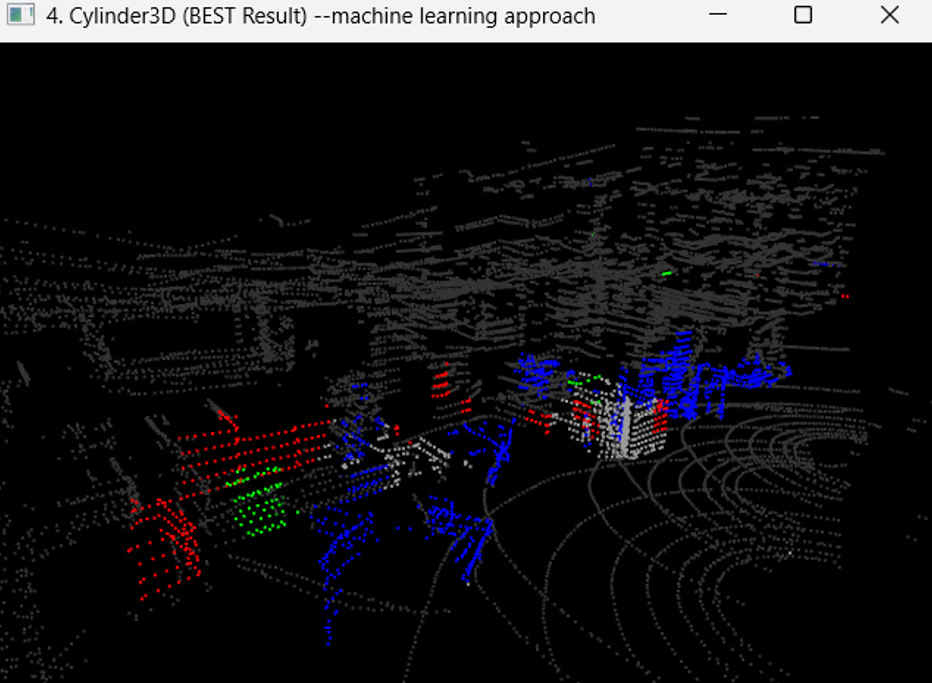
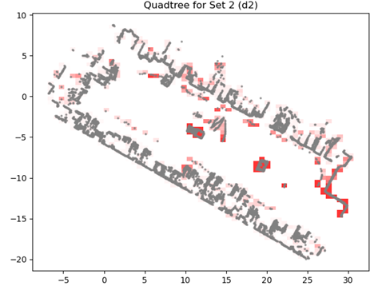

# 3D & 2D LiDAR Change Detection Framework

This repository implements a robust pipeline for detecting structural and object-level changes in **multi-temporal LiDAR point cloud data**. The framework is designed for **dynamic environments** such as warehouses and urban scenes, where inventory movement, occlusions, and sensor noise present significant challenges.



The system compares point clouds acquired at different time intervals and identifies meaningful changes while minimizing false positives caused by viewpoint shifts, sampling noise, and occlusion ghosting.

---

## 📌 Key Features

- Multi-temporal LiDAR change detection
- Hybrid 2D and 3D workflows
- Geometric vs. semantic comparison
- Robust handling of occlusions and ghost artifacts
- Scalable to large indoor environments

---

## Framework Overview

The repository contains two independent but complementary modules:

### 1. 2D Change Detection (Planar LiDAR)
A fast, quadtree-based approach designed for 2D laser scans.

### 2. 3D Change Detection (Volumetric LiDAR)
An advanced workflow comparing **purely geometric** methods against a **semantic AI-based approach** to overcome occlusion and noise-related artifacts.

---

## 3D Change Detection (Volumetric)

The 3D module focuses on detecting **moved inventory objects** (e.g., pallets, boxes) in warehouse environments while **filtering out static infrastructure** such as walls, floors, and racks.

Three methods were implemented and evaluated:

---

### Method 1: Raw Geometric Registration (Baseline)

**Approach**
- Aligns multi-temporal point clouds using **Multiscale GICP (Generalized ICP)**
- Performs a raw **KD-Tree distance check** with radius `r = 0.4 m`

**Results**
- Detects large, obvious changes
- Highly sensitive to sensor viewpoint shifts
- Static structures are frequently misclassified as changes

**Limitations**
- High false-positive rate
- Severe ghosting artifacts

---

### Method 2: Geometric Segmentation (RANSAC)

**Approach**
- Uses **iterative RANSAC plane fitting**
- Explicitly removes dominant planes (floor and walls)

**Results**
- Effectively removes floor-related noise
- Reduces false positives from large planar surfaces

**Limitations**
- Context-blind geometry
- Flat inventory objects may be removed incorrectly
- Degrades on uneven ground

---

### Method 3: Semantic AI Segmentation (Proposed Solution)

**Approach**
- Uses **Cylinder3D** for semantic segmentation
- Performs change detection only on **semantically relevant objects**

**Semantic Filtering**
- Ignored (Infrastructure):
  - Walls (Class 12)
  - Floor (Classes 8–11)
- Tracked (Inventory / Dynamic Objects):
  - Fences / Cages (Class 13)
  - Vegetation
  - Unclassified objects

**Results**
- Eliminates occlusion ghosting
- Revealed walls are correctly ignored after object movement
- Substantially reduces false positives

3D Change Detection results  
Grey = Static background  
Red / Green / Blue = Changes over three timestamps

For a visual comparison of the methods, see this video on YouTube: [watch here](https://www.youtube.com/watch?v=iob8_ANVBWI)


---

## 2D Change Detection (Planar)

This module targets 2D LiDAR scans using a **hierarchical spatial aggregation strategy**.

### Quadtree Aggregation
- Recursively subdivides the plane into quadtree cells
- Detects changes at the **cell level** instead of per point
- Improves robustness to noise and misalignment

### Clustering
- Uses **DBSCAN** to group change cells
- Produces coherent object-level detections

**Figure 2**



2D Quadtree-based change detection map

---

## 🛠️ Installation & Requirements

### System Dependencies

- **ROS 2 Humble** (for `.mcap` / `.db3` bags)
- **CUDA 11.8** (for Cylinder3D acceleration)

### Python Dependencies

```bash
pip install open3d numpy rosbags
```

